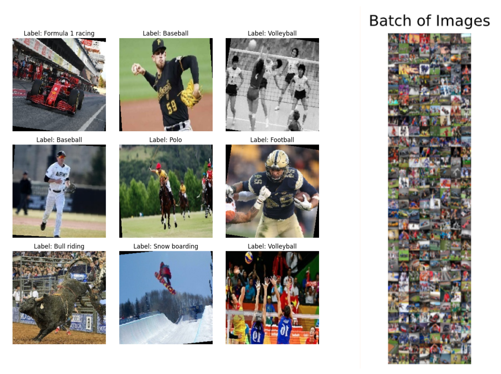
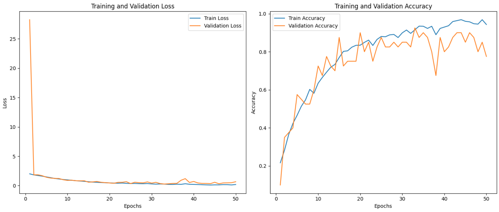

# Based on Gigant Shoulders: Neural Network for Sport Image Classification

## 📖 About

This project investigates the performance of image classification neural networks leveraging pre-trained models. The main objective is to evaluate the efficiency and accuracy of various architectures in recognizing and categorizing sports images. The analysis compares a neural network developed from scratch to various pre-trained models under diverse training configurations, assessing key metrics such as accuracy and computational complexity.

## Authors

- *Alberto Venturini*
- *Andrea Sciortino*

## Dataset

The [100 Sports Classification dataset](https://www.kaggle.com/datasets/gpiosenka/sports-classification) (available on Kaggle) contains more than 100,000 color images (224×224 pixels) representing 100 different sports categories. For this project, 11 categories were selected, each with 15 to 20 images. 
The dataset is then organized into balanced training, validation, and test sets.

<div align="center">
  
</div>

## Project Structure

1. **Data Loading and Augmentation**:
   
   Import raw image data,and apply transformations: random cropping, flipping, normalization
   to increase dataset diversity and improve model generalization.

3. **Model Definitions**:

   Develop custom convolutional neural network and load the pre-trained architecture model (with froozen last layers).
   
   ***Simple Net***
   
   ```
   net = nn.Sequential(
    nn.Conv2d(3, 96, kernel_size=11, stride=4, padding=1), nn.ReLU(), #96==> 30
    nn.MaxPool2d(kernel_size=3, stride=2),

    nn.Conv2d(96, 192, kernel_size=5, padding=2), nn.ReLU(), #96==> 30, 256=>96
    nn.MaxPool2d(kernel_size=3, stride=2),

    nn.Conv2d(192, 384, kernel_size=3, padding=1), nn.ReLU(), #reduce the 3 layers to 2
    nn.Conv2d(384, 600, kernel_size=3, padding=1), nn.ReLU(),
    nn.MaxPool2d(kernel_size=3, stride=2),
    nn.Flatten(),

    nn.Linear(15000, 2400), nn.ReLU(),
    nn.Dropout(p=0.5),

    nn.Linear(2400, 8))
   ```
   
   ***Dense Net*** with froozen layes to leverage transer learning.

   ```
   base_model = models.densenet121(pretrained=True)
   
   for param in base_model.parameters():
    param.requires_grad = False
   
   all_conv_layers = list(base_model.features.children())
   num_trainable_layers = 10  # train last 10 layers

   # Set the Classifier
   base_model.classifier = nn.Sequential(
    nn.Linear(base_model.classifier.in_features, 512),
    nn.ReLU(),
    nn.Linear(512, 8))
   ```

6. **Training and Evaluation**:

   Train each model on the processed datasets, monitor performance using validation data, and tune hyperparameters to optimize accuracy and reduce overfitting.

8. **Performance Analysis**. Compare results from different models and configurations by examining metrics like accuracy, precision and training/test loss curves: visualize findings to identify the most effective strategies.

## 💡 Results

DenseNet121, leveraging pre-trained weights and transfer learning, achieved higher accuracy and generalization, particularly with limited training data. The Simple Net demonstrated competitive performance but was more sensitive to the size of the training set and hyperparameter choices. 

The best results were achived with the following settings:

- `batch_size = 128`
- `lr = 0.0001`
- `num_epochs = 50`

<div align="center">

</div>


